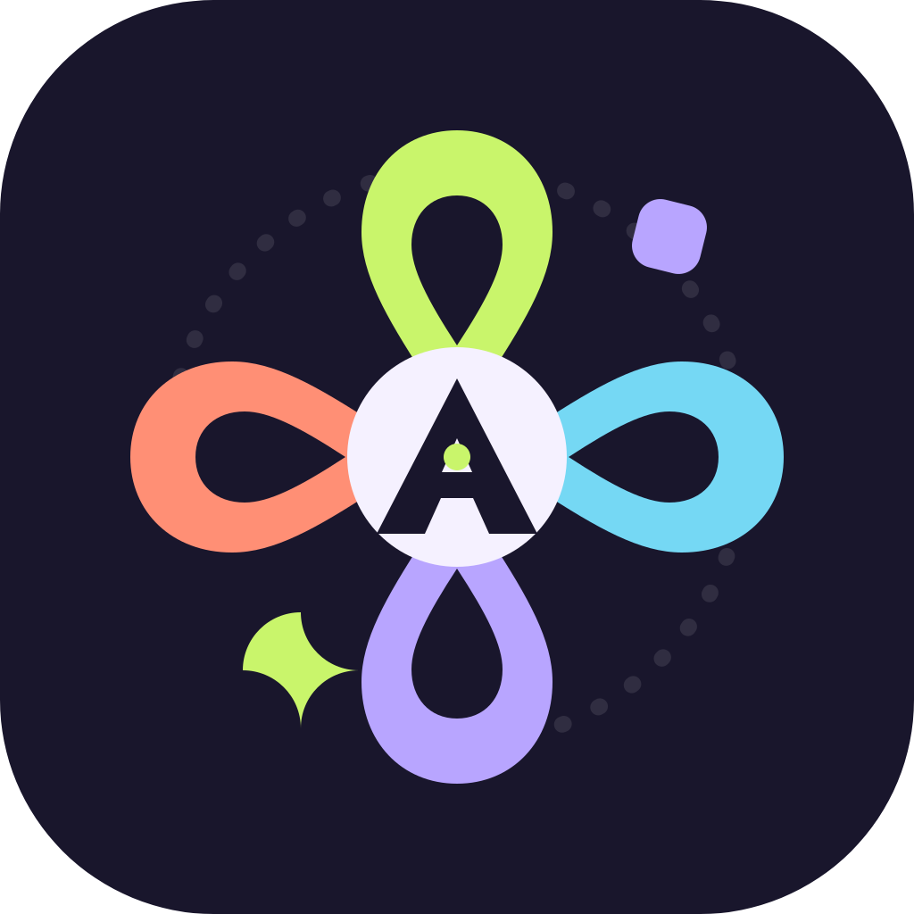

  

<h1 align="center">Axis</h1>

  <i>An ecosystem of Material 3 apps made with an expressive style by XDan.</i>

  <a href="https://github.com/XDanfr/Aperture/releases/latest"><strong>Download Aperture</strong></a> •
  <a href="https://discord.gg/vne5ED9xsm">Discord Server

Axis is the shared home for a growing set of expressive, device-aware apps. Each project has its own purpose, but they share the same principles: thoughtful interaction, Material 3 Expressive visual language, and software that feels personal rather than generic.

  

<strong>Aperture: Material 3 media player for Android TV</strong>

 

Aperture is a Material 3 media player designed around the living-room screen. It brings local movies and TV shows together in a focused, remote-friendly interface.

Some features:

- TV-optimised navigation and large-screen layouts
- Media3-powered playback
- Local library scanning for movies and TV shows
- TMDb name matching and artwork/metadata detection
- Custom themes and an expressive Material 3 interface

  <a href="https://github.com/XDanfr/Aperture/releases/latest">⬇️ Download the latest Aperture alpha</a>
  ·
  <a href="https://github.com/XDanfr/Aperture">View Aperture on GitHub</a>

  

<strong>Motif — expressive, device-aware wallpapers</strong>

 

Motif is an Android app for creating expressive, device-aware Material 3 wallpapers. It treats a wallpaper as a composition: shapes, colours, images, layers, and movement working together on the canvas.

Planned features:

- Generate compositions from curated Material-inspired rules
- Create wallpapers for custom canvas sizes, including foldable layouts
- Move, resize, rotate, recolour, and layer objects directly on canvas
- Save reusable presets and export/apply wallpapers

  <a href="https://github.com/XDanfr/Motif">⬇️ Download or build Motif</a>
  ·
  <a href="https://github.com/XDanfr/Motif">View Motif on GitHub</a>

## Design philosophy

Axis projects are built to be expressive without becoming noisy, practical without feeling plain, and consistent without forcing every app into the same mould. The ecosystem uses Material 3 as a foundation, then gives each product room to develop its own identity.

More projects will be added as they take shape.
